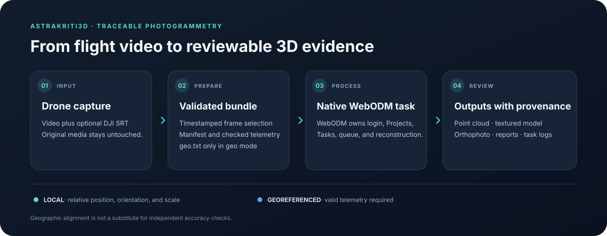

<p align="center">
  
</p>

<h1 align="center">Astrakriti3D</h1>

<p align="center">
  <strong>Turn drone video into a traceable 3D reconstruction workflow.</strong><br>
  Video preparation and optional telemetry georeferencing, integrated with WebODM’s native projects, tasks, viewers, and exports.
</p>

<p align="center">
  <a href="docs/COMPANION_API.md">Companion API</a> ·
  <a href="docs/PRODUCTION_BASELINE.md">R1 baseline</a> ·
  <a href="docs/INTEGRATION_BOUNDARY.md">Architecture</a>
</p>

## What it does

Astrakriti3D prepares drone video for photogrammetry and connects that preparation to a customized WebODM workspace. The authenticated companion validates video and optional DJI SRT telemetry, then returns a preparation bundle for a native WebODM task. WebODM remains the source of truth for sign-in, projects, tasks, processing, task status, viewers, and generated assets.

- **Repeatable video preparation:** inspect video timestamps and extract an ordered set of frames without modifying the source.
- **Two clear coordinate modes:** process video alone for a local model, or provide valid SRT telemetry to prepare georeferenced inputs.
- **Native reconstruction workflow:** use WebODM and NodeODM for task processing and their established viewers and exports.
- **Traceable runs:** retain manifests, task state, logs, and output records so a result can be investigated later.
- **Controlled experiments:** compare alternative frame selectors separately while keeping the validated R1 workflow frozen.

## Workflow



### A real project output


*This is a real WebODM orthophoto preview from the project’s R1 work. The recorded example has visible coverage gaps, so it is useful evidence of the pipeline and its current quality limits—not a claim of a complete survey product.*

## Verified R1 reference

R1 is the frozen production reference for the project's DJI capture. Its documented record uses deterministic one-frame-per-second extraction and the installed WebODM defaults; see the [machine-readable baseline](config/r1_baseline.json).

| Recorded R1 result | Value |
| --- | ---: |
| Selected source frames | 194 |
| Registered images | 194 |
| Reprojection error | 0.921 px |
| Median / P95 GPS residual | 0.373 m / 0.941 m |
| Dense point cloud | About 2.43 million points |
| Available model outputs | Mesh and textured GLB/ZIP, plus orthophoto and report artifacts |

These figures describe one dataset and its recorded acceptance run; they are not a cross-dataset benchmark or independent proof of absolute accuracy. GPS residuals measure agreement with supplied telemetry. Survey checkpoints or a trusted reference surface are needed to assess real-world accuracy.

R2, R3, and adaptive frame selectors remain experimental. They are evaluated in separate evidence directories and do not silently replace R1.

## Coordinate modes

| Mode | Inputs | What the coordinates mean |
| --- | --- | --- |
| <code>local</code> | Video | A reconstruction-relative model. Absolute position, CRS, geographic orientation, and GPS residuals are unavailable. |
| <code>georeferenced</code> | Video and valid DJI SRT telemetry | Frames are associated with telemetry and prepared with an EPSG:4326 <code>geo.txt</code>. This provides geographic alignment inputs, not independent accuracy validation. |

## Quick start

### Run the integrated WebODM workspace

Requirements: Docker with Compose, and Git.

```powershell
git clone --recurse-submodules https://github.com/YashwanthDevelops/Astrakriti3D.git
Set-Location Astrakriti3D
Set-Location "Reconstruction layer"

$env:ASTRAKRITI_COMPANION_TOKEN = [Convert]::ToHexString(
    [Security.Cryptography.RandomNumberGenerator]::GetBytes(32)
)

docker compose -f docker-compose.yml -f docker-compose.build.yml -f docker-compose.astrakriti.yml up -d --build astrakriti-companion webapp
```

Open the authenticated WebODM interface and visit <code>/astrakriti/overview/</code>. Keep the companion token in your secret store; do not commit it or expose it to browser code. See the [deployment and API guide](docs/COMPANION_API.md) for configuration, service health, and the full request contract.

### Run local preparation tools

Requirements: Python 3.12, FFmpeg, and ffprobe on <code>PATH</code>.

```powershell
Set-Location "C:/path/to/Astrakriti3D"
py -3.12 -m venv .venv
./.venv/Scripts/Activate.ps1
python -m pip install -r requirements.txt
Copy-Item .env.example .env

python run_astrakriti.py prepare --mode local --video "C:/path/to/capture.mp4" --output runs/local
```

For georeferenced preparation, use <code>--mode georeferenced</code>, provide <code>--srt "C:/path/to/capture.SRT"</code>, and write to a fresh output directory. To submit a reconstruction through the CLI, configure the WebODM connection in <code>.env</code> and run the non-submitting <code>preflight</code> command first. The exact R1 workflow and safety checks are documented in the [production baseline](docs/PRODUCTION_BASELINE.md).

## Repository map

| Path | Purpose |
| --- | --- |
| <code>astrakriti3d/</code> | Preparation, companion API, CLI, recovery, storage, and telemetry workflows. |
| <code>Reconstruction layer/</code> | Customized WebODM application, Astrakriti3D integration, and Docker Compose deployment. |
| <code>config/</code> | R1 baseline contract and application configuration. |
| <code>docs/</code> | API contract, production baseline, integration boundary, and operating notes. |
| <code>evidence/</code> | Preserved validation and experiment records. |
| <code>scripts/</code> | Diagnostics, baseline validation, and offline selector experiments. |
| <code>tests/</code> | Python unit and integration tests. |

## Documentation

- [Preparation companion API and deployment](docs/COMPANION_API.md)
- [Frozen R1 workflow and acceptance references](docs/PRODUCTION_BASELINE.md)
- [Production integration boundary](docs/INTEGRATION_BOUNDARY.md)
- [Implementation history](docs/IMPLEMENTATION_PHASES_WEBODM.md)
- [Customized WebODM source and vendoring notes](Reconstruction%20layer/ASTRAKRITI3D_SOURCE.md)

## Known limits

- Video-only <code>local</code> runs have arbitrary reconstruction orientation and scale; do not treat them as geographic measurements.
- GPS and camera residuals do not replace independent checkpoints or a surveyed reference.
- Results depend on image overlap, motion, lighting, texture, and available compute. The recorded R1 preview shows coverage gaps.
- Alternative selectors and aggressive processing settings are experiments, not promoted production defaults.
- Keep credentials, source video, generated evidence, and runtime databases out of Git. <code>.env</code> is local configuration and must remain private.

## Attribution

<code>Reconstruction layer/</code> contains customized, vendored WebODM source. Preserve its upstream license, trademark, and attribution files. Clone with <code>--recurse-submodules</code> to restore the WebODM locale and NodeODM dependencies. See the [source provenance notes](Reconstruction%20layer/ASTRAKRITI3D_SOURCE.md) and the [WebODM project](https://github.com/OpenDroneMap/WebODM).
