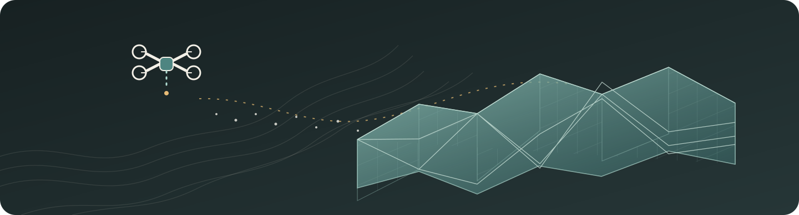
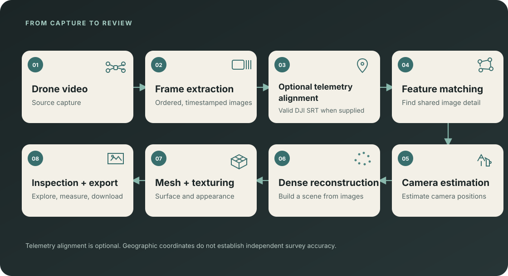
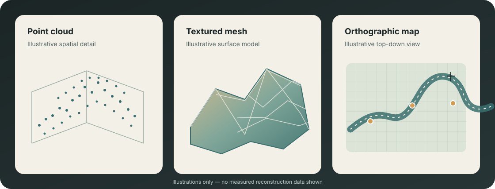
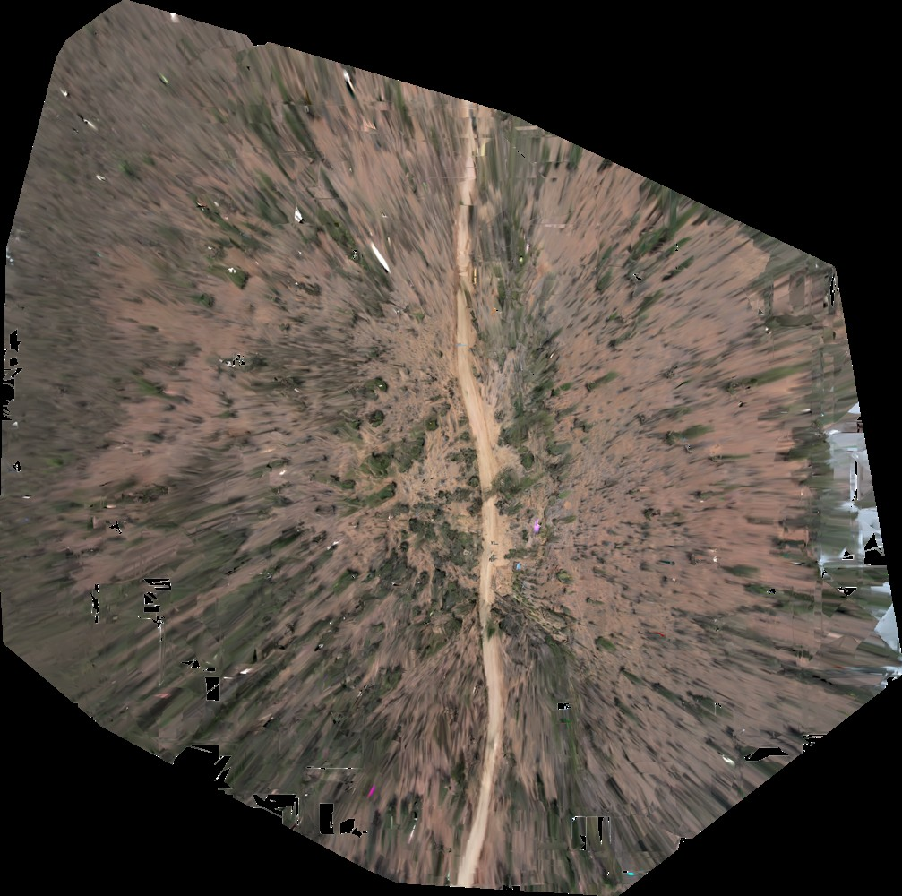

  

<h1 align="center">Astrakriti3D</h1>

  <strong>From drone footage to explorable 3D.</strong> 
  A unified workflow for video preparation, telemetry alignment, reconstruction, inspection, and export.

  

  <a href="https://astrakriti3d.vercel.app/">Visit the landing page</a>
   
  Presentation website — backend integration coming later.

  <a href="#overview">Overview</a> ·
  <a href="#capabilities">Capabilities</a> ·
  <a href="#how-it-works">How it works</a> ·
  <a href="#outputs">Outputs</a> ·
  <a href="#performance">Performance</a> ·
  <a href="#quick-start">Getting started</a> ·
  <a href="#architecture">Architecture</a> ·
  <a href="#roadmap-and-credits">Roadmap and credits</a>

## Overview

Astrakriti3D takes drone video through preparation and photogrammetric reconstruction into an integrated workspace for reviewing 3D and map outputs. Use video on its own for a local model, or add supported telemetry to prepare geographically aligned inputs.

The workflow keeps capture preparation, processing status, inspection, and downloads connected. It is designed for aerial surveys, site documentation, and other projects where a flight video needs to become something a team can explore.

## Product direction

**A 3D model is the starting point. Astrakriti3D aims to turn one drone video into a georeferenced, measurable, inspectable digital representation of a real site.**

**Capture** (single video + optional DJI SRT) → **Reconstruct** (automated preparation and photogrammetry) → **Understand** (anomaly indicators) → **Trust** (geographic alignment and coverage context) → **Interact** (3D outputs and measurements).

These capabilities describe the product direction and current implementation status:

- **Capture — 🎥 Single-pass drone video:** supported; prepare a video directly without first assembling a separate still-image set.
- **Capture — 📡 GNSS/SRT integration:** supported for DJI SRT telemetry, which provides geographic alignment inputs. It does not independently prove positional accuracy.
- **Reconstruct — 🧠 AI/intelligent frame selection:** experimental feature- and coverage-aware selectors are available; deterministic one-frame-per-second sampling remains the default. The experimental selectors are not represented as AI models.
- **Reconstruct — 🔄 End-to-end automation:** partial; the CLI can run preflight, preparation, and reconstruction submission. Generated products still need review and validation.
- **Reconstruct — ⚡ <10 min reconstruction target:** engineering target only; benchmark validation is pending.
- **Understand — 🏚️ Crack/anomaly detection:** planned; the current pipeline does not automatically detect or classify structural defects.
- **Understand — 🚨 Early structural diagnosis:** planned; it depends on validated detection and appropriate engineering assessment.
- **Understand — 🌙 Low-light/night capability:** not yet validated; no night-specific performance claim is made.
- **Trust — 📍 Sub-meter geospatial accuracy:** not established; independent survey checkpoints or a trusted reference are needed to validate it.
- **Trust — 🗺️ Coverage / missing-region detection:** experimental coverage-aware frame selection exists, but the product does not yet provide a validated map of trustworthy and missing regions.
- **Interact — ✨ Gaussian Splat output:** planned; Gaussian Splats are not among the outputs documented for the current pipeline.
- **Interact — 📏 Metric measurement:** available for task-associated distance, area, and volume records. Volume requires a valid DSM, and geographic measurements depend on valid georeferencing.

## Capabilities

- **Prepare video for reconstruction:** inspect timestamps and extract ordered frames at a repeatable interval.
- **Choose a coordinate mode:** work with video alone, or align frames with supported DJI SRT telemetry.
- **Reconstruct and inspect:** review point clouds, textured models, and mapping products when those outputs are generated.
- **Measure in context:** use task-associated distance, area, and volume measurement records; volume requires a valid DSM.
- **Keep preparation traceable:** retain frame manifests and explicit input-mode information with prepared inputs.
- **Export task products:** download the assets made available by a completed task.

| Workflow | What changes |
| --- | --- |
| Video only | Uses local reconstruction coordinates with arbitrary position, orientation, and scale. |
| Video + valid DJI SRT | Aligns frames with telemetry and provides geographic positioning inputs. Independent survey checks are still needed to establish real-world accuracy. |

## How it works

**Drone video → frame extraction → optional telemetry alignment → feature matching → camera estimation → dense reconstruction → meshing and texturing → inspection and export.**

Frame extraction currently defaults to deterministic one-frame-per-second sampling. The <code>select-frames</code> and <code>adaptive-select</code> CLI paths are experimental and do not replace that default.

## Outputs

*Illustrative artwork only. Actual products depend on the source video and task settings.*

- **Point cloud:** explore reconstructed scene detail in the 3D viewer; point-cloud files are available when generated by the task.
- **Mesh and textured model:** inspect a surface model; textured GLB or ZIP artifacts are available where produced by the task.
- **Orthophoto and elevation products:** review map imagery, with DSM/DTM products when enabled and generated.
- **Reports and task files:** download the outputs and reports exposed by the completed task. Formats depend on the generated products.

### Example orthophoto

This is an actual project output preview. Coverage gaps are visible, and the image is not an independently validated survey product.

## Performance

> **Engineering target: reconstruct a 10-minute drone video in under 10 minutes. Benchmark validation pending.**

This target is not a measured runtime claim. A useful comparison requires the same input, hardware, settings, timing boundary, and a defined quality measure; no such benchmark is published here yet.

## Quick start

### Prepare a video locally

Requirements: Python 3.10 or later, FFmpeg, and <code>ffprobe</code> on <code>PATH</code>.

~~~powershell
git clone --recurse-submodules https://github.com/YashwanthDevelops/Astrakriti3D.git
Set-Location Astrakriti3D
python -m venv .venv
.\.venv\Scripts\Activate.ps1
python -m pip install -r requirements.txt
python run_astrakriti.py --help

python run_astrakriti.py prepare `
  --mode local `
  --video "C:/path/to/capture.mp4" `
  --output "C:/path/to/local-preparation"
~~~

For geographically aligned preparation, use <code>--mode georeferenced</code> and add <code>--srt "C:/path/to/capture.SRT"</code>. Use a fresh output directory for each preparation.

### Run the integrated workspace

Requirements: Docker with Compose and Git.

~~~powershell
Set-Location "Reconstruction layer"
$env:ASTRAKRITI_COMPANION_TOKEN = [Convert]::ToHexString(
    [Security.Cryptography.RandomNumberGenerator]::GetBytes(32)
)

docker compose `
  -f docker-compose.yml `
  -f docker-compose.build.yml `
  -f docker-compose.astrakriti.yml up -d --build astrakriti-companion webapp
~~~

Open the WebODM interface and visit <code>/astrakriti/overview/</code>. Keep the companion token private. The [companion API and deployment guide](docs/COMPANION_API.md) covers service configuration and the preparation contract.

The CLI also has a <code>run</code> command that performs preflight, preparation, and reconstruction. Configure WebODM credentials in <code>.env</code> first; the command submits a task only after preflight passes:

~~~powershell
if (-not (Test-Path .env)) { Copy-Item .env.example .env }
# Set WEBODM_BASE_URL, WEBODM_USERNAME, and WEBODM_PASSWORD in .env.
python run_astrakriti.py run `
  --mode local `
  --video "C:/path/to/capture.mp4" `
  --output "C:/path/to/local-run"
~~~

See the [production workflow reference](docs/PRODUCTION_BASELINE.md) for the separate preflight and reconstruction commands.

## Architecture

~~~mermaid
flowchart LR
    input["Drone video Optional DJI SRT"] --> prep["Astrakriti3D preparation CLI or companion API"]
    prep --> bundle["Frames + manifest Optional geo.txt"]
    bundle --> webodm["WebODM Authentication, projects, tasks"]
    webodm --> nodeodm["NodeODM processing"]
    nodeodm --> webodm
    webodm --> review["3D and map viewers Measurements and task downloads"]
~~~

The companion prepares video and telemetry inputs. WebODM remains responsible for sign-in, projects, tasks, processing status, viewers, and task files.

- <code>astrakriti3d/</code> — video and telemetry preparation, CLI orchestration, companion API, and recovery.
- <code>Reconstruction layer/</code> — integrated WebODM application, Astrakriti3D interface, and Compose deployment.
- <code>config/</code> — processing contracts and configuration.
- <code>docs/</code> — API, deployment, architecture, and operating references.
- <code>scripts/</code> — diagnostics and offline validation tools.
- <code>tests/</code> — Python tests for preparation and orchestration.

## Roadmap and credits

- Complete fresh end-to-end validation of the integrated workflow, including generated models, maps, measurements, and downloads.
- Measure the under-10-minute target on documented inputs and hardware before publishing a runtime result.
- Evaluate experimental frame selectors against comparable coverage and reconstruction-quality evidence before considering them as defaults.
- Connect the presentation website to the reconstruction backend.

**Documentation:** [Companion API and deployment](docs/COMPANION_API.md) · [Production workflow](docs/PRODUCTION_BASELINE.md) · [Integration boundary](docs/INTEGRATION_BOUNDARY.md) · [WebODM integration phases](docs/IMPLEMENTATION_PHASES_WEBODM.md)

**Credits:** Astrakriti3D uses WebODM and NodeODM for its reconstruction stack. The customized WebODM source and upstream notices are described in the [source provenance notes](Reconstruction%20layer/ASTRAKRITI3D_SOURCE.md). See the [license notes](LICENSE_NOTES.md), [WebODM license](Reconstruction%20layer/LICENSE.md), and [security policy](Reconstruction%20layer/SECURITY.md).

## Known limits

- Video-only local models have arbitrary orientation and scale; do not interpret them as geographic measurements.
- Telemetry supplies geographic alignment inputs, not independent accuracy validation.
- Reconstruction quality depends on overlap, camera motion, lighting, surface texture, and available compute.
- DSM-dependent measurements require a valid generated DSM.
- Keep credentials, source video, telemetry, generated evidence, and runtime data out of version control.
